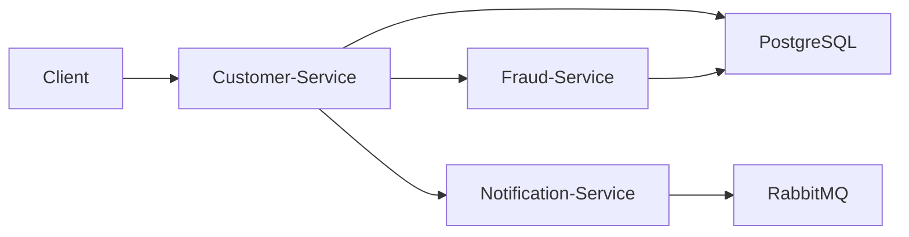

# 🚀 Spring Microservices with Docker


A **Spring Boot Microservices project** demonstrating how to build and run microservices using **Docker containers**.

This repository shows how multiple services can be developed independently and deployed using containerization.

---

# 📖 Project Overview

This project demonstrates a **microservices architecture using Spring Boot and Docker**.

Microservices architecture divides a large application into smaller independent services that communicate with each other.

Key ideas demonstrated in this project:

- Independent microservices
- REST API communication
- Docker containerization
- Service isolation
- Scalable architecture

---

# 🏗 Architecture



---

# ⚙️ Tech Stack

### Backend

- Java
- Spring Boot
- Spring Web
- Spring Data JPA

### Messaging

- RabbitMQ

### Database

- PostgreSQL

### DevOps

- Docker
- Docker Compose
- Maven

---

# 📂 Project Structure

```
spring_microservices_with_docker
│
├── customer
│   └── Customer service
│
├── fraud
│   └── Fraud detection service
│
├── notification
│   └── Notification service
│
├── docker-compose.yml
│
└── README.md
```

---

# 🚀 Getting Started

## 1️⃣ Clone the Repository

```bash
git clone https://github.com/chunJyi/spring_microservices_with_docker.git
cd spring_microservices_with_docker
```

---

# 🔧 Build the Project

Use Maven to build the services.

```bash
mvn clean install
```

---

# 🐳 Run with Docker

Start all services using Docker Compose.

```bash
docker-compose up -d
```

Check running containers:

```bash
docker ps
```

Stop containers:

```bash
docker-compose down
```

---

# 🧪 API Example

Create a new customer.

### Endpoint

```
POST /api/v1/customers
```

### Request Body

```json
{
  "name": "John",
  "email": "john@example.com"
}
```

---

# 📦 Microservices

This project contains the following services:

### Customer Service

Handles customer registration and management.

### Fraud Service

Checks whether a customer is fraudulent.

### Notification Service

Sends notifications when a customer registers.

---

# 🐳 Docker Containers

Each microservice runs inside its own Docker container.

Benefits:

- Isolation
- Portability
- Easy deployment
- Scalable infrastructure

---

# 🤝 Contributing

Contributions are welcome.

1. Fork the repository

2. Create a branch

```
git checkout -b feature/new-feature
```

3. Commit your changes

```
git commit -m "Add new feature"
```

4. Push your branch

```
git push origin feature/new-feature
```

5. Create Pull Request

---

# 📄 License

This project is licensed under the **MIT License**.

---

# 👨‍💻 Author

**Chun**

Software Engineer

GitHub:  
https://github.com/chunJyi

---

⭐ If you like this project, please give it a star!
